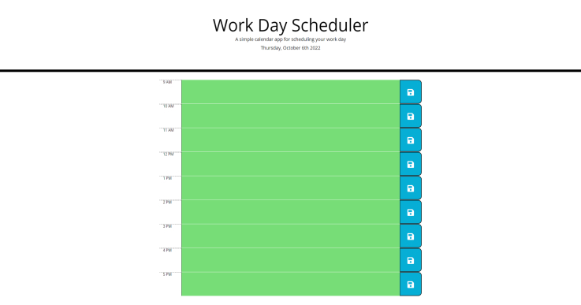
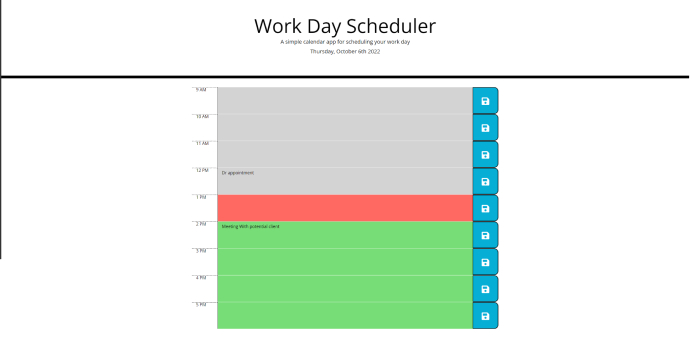
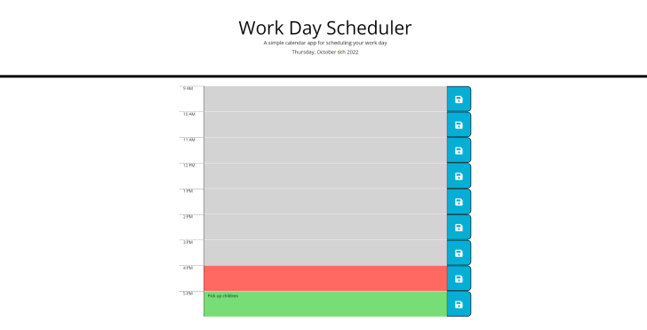

# Work Day Scheduler

## Overview

The application allows the user to save their appointments to a simple day planner. Appointments can be saved and the user can come back to the planner throughout the day.Furthermore, the application will change color depending on the hour of the day with green being in the future, red as current hour, and grey as the past. 

### learning points

- leverage third-party APIs like CSS frameworks, JavaScript libraries, and custom fonts.
- Use jQuery to perform DOM manipulation and traversals and implement interactivity using event handlers.
- Integrate Bootstrap components in HTML files to quickly build user interfaces.
- Use Moment.js to format dates and calculate time differences.

## User Story

```md
AS AN employee with a busy schedule
I WANT to add important events to a daily planner
SO THAT I can manage my time effectively
```

## Acceptance Criteria

```md
GIVEN I am using a daily planner to create a schedule
WHEN I open the planner
THEN the current day is displayed at the top of the calendar
WHEN I scroll down
THEN I am presented with timeblocks for standard business hours
WHEN I view the timeblocks for that day
THEN each timeblock is color coded to indicate whether it is in the past, present, or future
WHEN I click into a timeblock
THEN I can enter an event
WHEN I click the save button for that timeblock
THEN the text for that event is saved in local storage
WHEN I refresh the page
THEN the saved events persist
```

## Technologies

- **JQuery**
- **Moment.js**
- **Bootstrap**
- **FontAwesome**
- **Google-Fonts**
- **JavaScript**
- **HTML**
- **CSS**

## Screenshot/mockup


Morning

Lunch

Done

## CodeSnippets

### Click event handlers for save buttons

```JQuery
$('i').on('click', (event) => {
let savedNote = $(event.target);
let iconId = savedNote.parent().siblings().eq(1).attr("id");
let scheduleTask = savedNote.parent().siblings().eq(1).val();
workSchedule[iconId] = scheduleTask;
localStorage.setItem('workSchedule', JSON.stringify(workSchedule));
});
```

### Highlight the different times of the day with past, present, or future

```JQuery
if (currentHour >= 9 || currentHour <= 17) {
	for (let timeSlot of timeSlots) {
		if (timeSlot.data("timeMil") < currentHour) {
			timeSlot.children().eq(1).addClass('past');
		} else if (timeSlot.data("timeMil") == currentHour) {
			timeSlot.children().eq(1).removeClass('present');
		} else {
			timeSlot.children().eq(1).removeClass('future');
	}
}
```

## License

Please refer to the LICENSE in the repo.

## Links

### live Link

[Live website] https://kvance1010.github.io/Work-Day-Scheduler/

### LinkedIn

[LinkedIn] https://www.linkedin.com/in/kyle-s-vance
